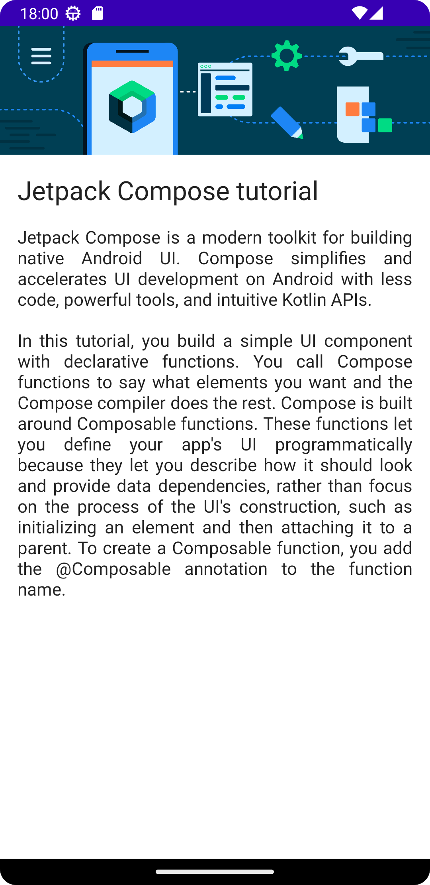
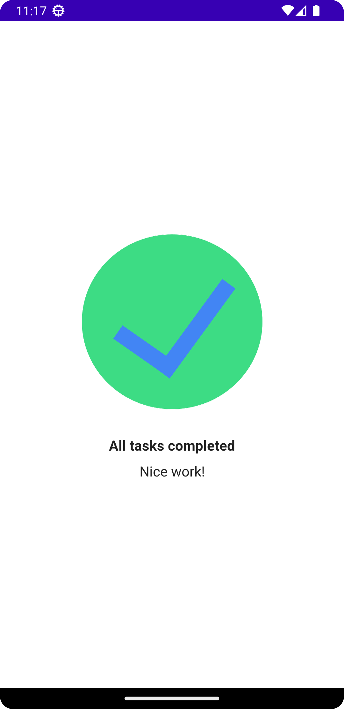
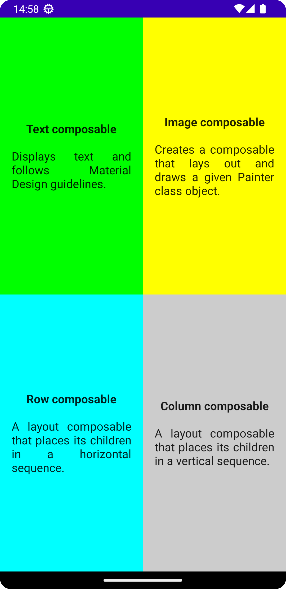

# Android Courses

My solutions for the exercises in Android Developer Courses

| Project | Preview |
|---------|---------|
| [ComposeArticle](android-basics-compose/ComposeArticle) |  |
| [TaskManager](android-basics-compose/TaskManager) |  |
| [ComposeQuadrant](android-basics-compose/ComposeQuadrant) |  |