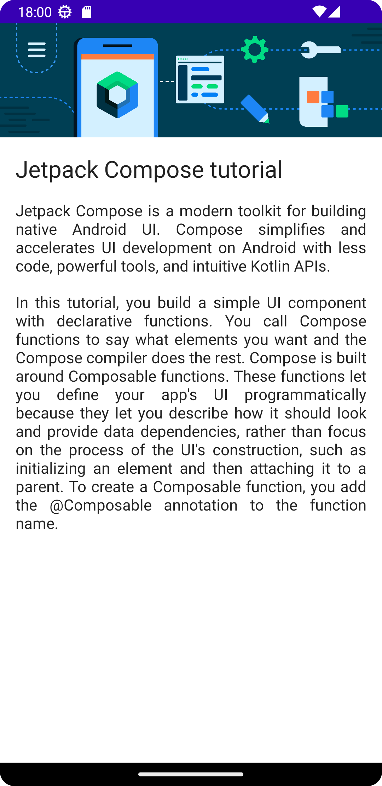
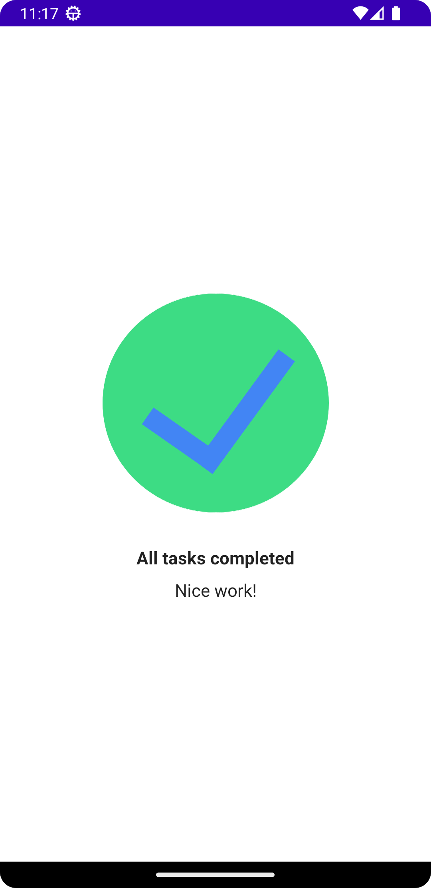
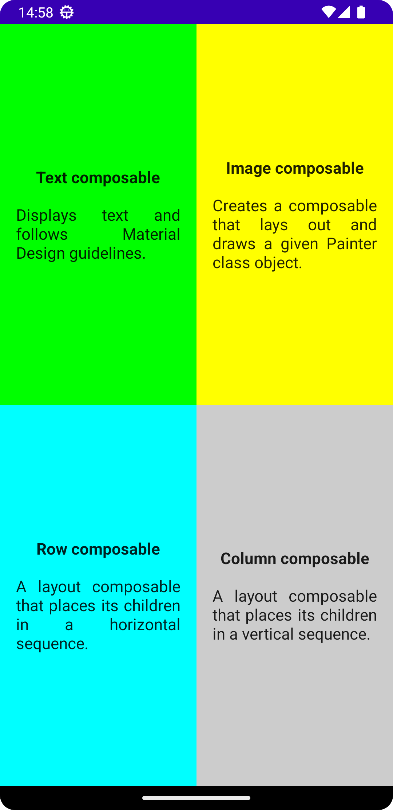

# Android Courses

My solutions for the exercises in Android Developer Courses

| Project | Preview |
|---------|---------|
| [ComposeArticle](android-basics-compose/unit-1/ComposeArticle) |  |
| [TaskManager](android-basics-compose/unit-1/TaskManager) |  |
| [ComposeQuadrant](android-basics-compose/unit-1/ComposeQuadrant) |  |
| [BusinessCard](android-basics-compose/unit-1/BusinessCard) |  |
